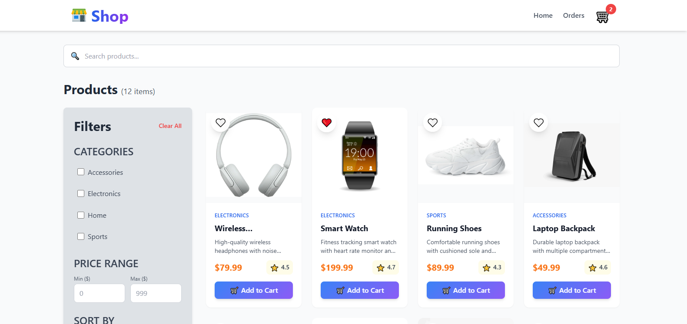

# Shop — Modern React E-Commerce

  
*A beautiful, fast, and fully functional e-commerce web application built with modern React best practices.*

**[View Live Site](https://ecommerce-app-virid-two.vercel.app/)** 
---

## ✨ Features

- 🛍️ **Smart Product Browsing** — Search, category filters, price range, sorting
- ❤️ **Favorites System** — Persistent favorites with localStorage
- 🛒 **Advanced Shopping Cart** — Add, update quantity, remove, clear cart
- 💾 **Persistent Data** — Cart + Favorites saved automatically in browser
- 📱 **Fully Responsive** — Perfect on mobile, tablet & desktop
- 🔄 **Multi-step Checkout** — Shipping + Payment + Review with real-time validation
- 🎉 **Order Success & History** — Full order flow with localStorage persistence
- ⚡ **Blazing Fast Performance** — Highly optimized Context API (no unnecessary re-renders)
- 🌟 **Premium UI/UX** — Custom Button component with loading states, variants, ripple effect & toast notifications

## 🛠️ Tech Stack

| Technology       | Purpose                          |
|------------------|----------------------------------|
| **React 18**     | UI Library                       |
| **Vite**         | Build tool & dev server          |
| **React Router** | Routing & navigation             |
| **Tailwind CSS** | Styling                          |
| **Context API**  | State management (highly optimized) |
| **react-hot-toast** | Notifications                 |

**Special Highlight:** The Cart Context is optimized with `useMemo` + `useCallback` to prevent the classic "adding to cart re-renders the whole page" problem.

---

## 🚀 Quick Start (Local Development)

### Prerequisites
- Node.js 18+
- npm or yarn

```bash
# 1. Clone the repository
git clone https://github.com/yourusername/vibestore.git
cd vibestore

# 2. Install dependencies
npm install

# 3. Start development server
npm run dev
